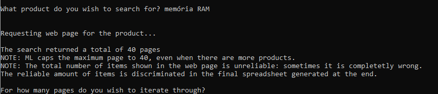
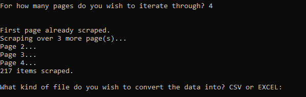
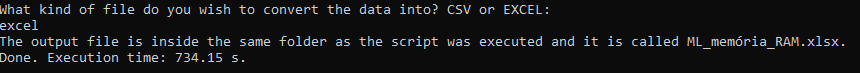
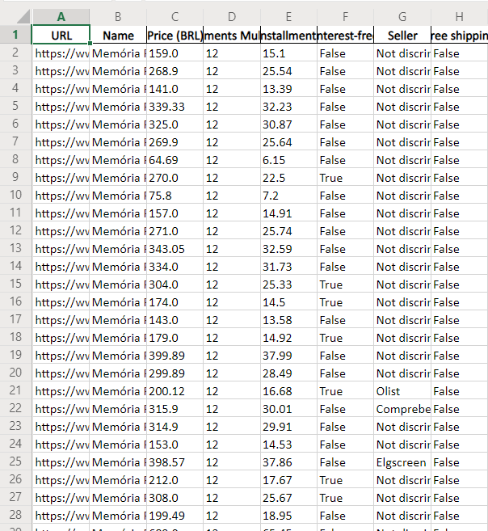

# Python-Data-Scrapers
## An ever growing script that comports data scrapers, written in Python, that web scrape specific web pages.

### Table of content
  - [Installation](#installation)
  - [Scrapers](#scrapers)
	  - [Mercado Livre Scraper](#mercado-livre-scraper)
  - [Next Steps](#next-steps)

### Installation
This projects was developed using Python 3.8.5. For more information on how to install Python, refer to [the official website](https://www.python.org/).<br>

First, download the project folder (i.e. Python-Data-Scrapers) or fork the project. Then, an optional step to avoid dependency hell would be to create a virtual environment to run the programm without any problems. You can do this by going to any directory's command prompt (preferably an easy-to-remember one, such as inside Python-Data-Scrapers folder) and run:
```sh
python -m venv project_venv
```
Where project_venv is the name of the virtual environment (it can be whatever name you want it to be). You will notice that a folder called project_venv will be created. To activate the virtual environment, go to project_venv/Scripts and run:
```sh
activate
```
Now that you are inside the virtual environment, you can install any Python package without worrying about compromising any installed packages in your root system. To install the required packages for this project, inside the virtual environment, go to the project folder, where the file requirements.txt is (i.e. cd Python-Data-Scrapers), and run the following line:
```sh
(project_env) pip install -r requirements.txt
```
And with that, all of the required packages will be installed in your virtual environment. Finally, to exit the virtual environment simply type:
```sh
(project_env) deactivate
```
<strong>NOTE: This is a safe script, but always check on which kind of script you are running on your PC, specially when it's been downloaded from the Internet!</strong> 
<strong>NOTE 2: The code documentation can be found inside the script.</strong> 

### Scrapers
A list of web scrapers already implemented.
#### Mercado Livre Scraper
Outputs a CSV or a XLSX (Excel) file with all the items scraped from a search's result page, or pages of a product. The features of the output table are: URL, product name, price, installments multiplier, price per installment with this multiplier, whether it can be bought interest-free, seller (when it's discriminated), and whether the shipping is free.

To run this script, go to the folder where it's located (i.e. Python-Data-Scrapers/ML_Data_Scraper) and run:
```sh
python ML_Data-Scraper.py
```
If you are using a virtual environment (i.e. project_env), activate it first, then go to the folder where the script is located (still inside the virtual environment) and run:
```sh
(project_env) python ML_Data-Scraper.py
```
After you finished using the script, deactivate the virtual environment.

The script is very straightforward when it comes to how to use it, but here's an explanation:

When the script is run, the user will be prompt to input what kind of product they want to search. Since this is a Brazilian website, the example will be shown using Portuguese words for the products. For instance, if you want to scrape the price of RAMs (memória RAM in Portuguese), you would type:
<br>
This will search the product and scrape the first web page to get some information about it. The next step is to input how many pages you want to scrape. For instance, here the search returned a total of 40 pages, but you can create a table with only the results from the first 4 pages:
<br>
This particular search has returned 217 for 4 pages scraped. The next step is to convert the search to an output file. As of right now, you can choose between CSV and XLSX (Excel). Let's convert it to an XLSX file:
<br>
The created file will have be called ML_product_name.xlsx (or .csv) and it will be located inside the same folder that the script is. For this example, the file is called ML_memória_RAM.xlsx. The file looks like the following:
<br>
This table has, of course, 217 rows.

### Next Steps
For the time being, the next steps to this project are:
- Add an option to make the table into a SQL database;
- Make it into OOP and implement multiple classes to multiple websites, such as Amazon, Kabum (another Brazilian website), Saturn (a German website), and whatnot. The possibilities are endless;
- Create a whole framework out of it, with data storytelling tools, such as Matplotlib, Seaborn, Cufflinks, and Plotly.
